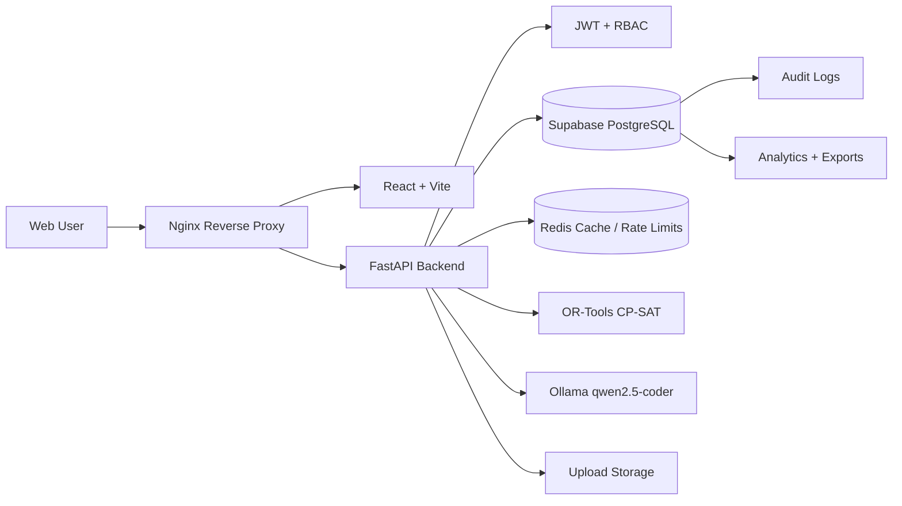
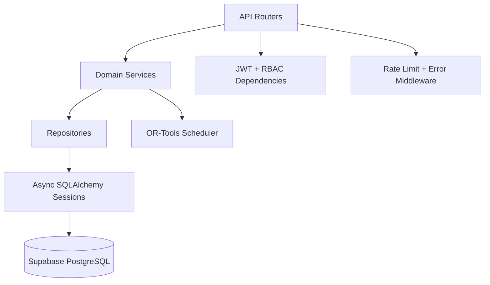
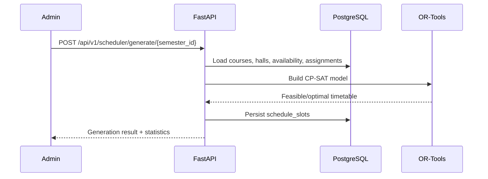
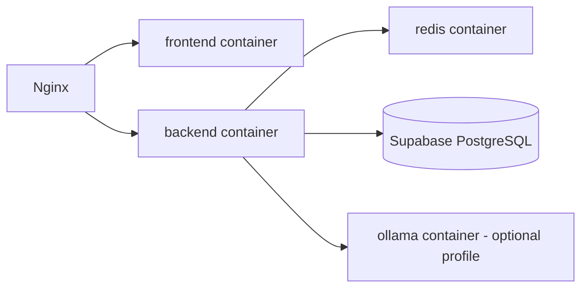

# HITU AI Platform

[](https://fastapi.tiangolo.com/)
[](https://react.dev/)
[](https://supabase.com/)
[](https://www.docker.com/)
[](#ai-engine)

HITU AI Platform is an enterprise university operating system for academic scheduling, learning management, analytics, role-based administration, and AI-assisted timetable generation. It combines a modern React command center, a secure FastAPI backend, Supabase PostgreSQL, Redis, Ollama, and Google OR-Tools to help universities generate high-quality timetables under real academic constraints.

> Security note: this repository intentionally contains no real API keys, database passwords, JWT secrets, Supabase service keys, or deployment credentials. Use `.env`, Docker secrets, or GitHub Secrets.

---

## Table of Contents

1. [Project Overview](#project-overview)
2. [Features](#features)
3. [User Stories](#user-stories)
4. [System Architecture](#system-architecture)
5. [Frontend Architecture](#frontend-architecture)
6. [Backend Architecture](#backend-architecture)
7. [Database Architecture](#database-architecture)
8. [AI Engine](#ai-engine)
9. [Docker Architecture](#docker-architecture)
10. [Security Layers](#security-layers)
11. [Testing Strategy](#testing-strategy)
12. [Installation Guide](#installation-guide)
13. [Local Development Setup](#local-development-setup)
14. [Environment Variables](#environment-variables)
15. [Docker Setup](#docker-setup)
16. [Deployment Guide](#deployment-guide)
17. [CI/CD Pipeline](#cicd-pipeline)
18. [API Documentation](#api-documentation)
19. [Screenshots](#screenshots)
20. [Future Improvements](#future-improvements)
21. [Contributors](#contributors)

---

## Project Overview

HITU AI Platform is designed as a production-grade academic operations layer for Higher Institute of Technology and university-scale environments.

### Idea

Academic scheduling is a high-dimensional constraint problem. Doctors have availability, assistants have availability, halls have capacities and equipment, courses have lectures/labs/sections, students have levels and departments, and administrators need reliable outputs without manual conflict chasing. HITU turns those constraints into a digital operating model.

### Vision

The platform aims to become a world-class AI university operating system:

- One source of truth for users, departments, semesters, halls, courses, enrollments, LMS content, submissions, exports, and analytics.
- AI-assisted timetable generation using deterministic optimization rather than manual trial-and-error.
- Enterprise security with JWT, RBAC, validation, rate limiting, audit trails, and backend-only secret handling.
- Deployment-ready infrastructure that works locally, in Docker, and against Supabase PostgreSQL.

### AI Scheduling Concept

The scheduling engine converts academic planning data into OR-Tools CP-SAT constraints:

- Hall capacity must satisfy course enrollment.
- Doctors, assistants, and halls cannot overlap.
- Availability windows and blocked periods are respected.
- Optimization strategies can favor balanced, compact, or distributed schedules.
- Generated schedules are persisted, auditable, exportable, and reviewable.

### Enterprise Goals

| Goal | Platform Capability |
| --- | --- |
| Operational reliability | Alembic migrations, health checks, Docker Compose, CI/CD |
| Data integrity | PostgreSQL constraints, indexes, foreign keys, cascades |
| Secure access | JWT authentication, RBAC, API validation, private secrets |
| Academic productivity | AI timetables, LMS workflows, exports, notifications |
| Decision support | Analytics tables, dashboards, audit logs, reporting |

---

## Features

### Academic Operations

- Semester, department, academic level, course, hall, and enrollment management.
- Doctor, assistant, hall, and student availability modeling.
- Course-to-staff assignment tracking.
- Student course enrollment and grade tracking.

### AI Timetable Generation

- OR-Tools CP-SAT solver integration.
- AI-generated schedule slots persisted in PostgreSQL.
- Conflict detection for halls, doctors, assistants, and overlapping sessions.
- Optimization modes for balanced, compact, or spread timetables.

### LMS

- Course materials.
- Assignments.
- Student submissions.
- Grading metadata and feedback.
- Notifications.

### Analytics and Exports

- Operational analytics snapshots.
- Export records for PDF, Excel, CSV, audit, LMS, and schedule reports.
- Audit logs for sensitive entity actions.

### Security and Governance

- JWT access and refresh tokens.
- Role-based access control with `roles`, `permissions`, `user_roles`, and `role_permissions`.
- Backend-only Supabase service role handling.
- Rate limiting and upload validation.
- No credentials committed to Git.

---

## User Stories

### Admin

- As an admin, I can manage users, roles, permissions, departments, academic levels, courses, halls, and semesters.
- As an admin, I can generate an AI timetable for a semester and review conflicts before publishing.
- As an admin, I can export schedules and analytics for institutional reporting.
- As an admin, I can inspect audit logs for sensitive platform actions.

### Doctor

- As a doctor, I can define availability and preferred teaching windows.
- As a doctor, I can view my assigned courses and generated timetable.
- As a doctor, I can upload materials, create assignments, and grade submissions.

### Assistant

- As an assistant, I can define availability for sections and labs.
- As an assistant, I can view assigned courses, sections, and student submissions.
- As an assistant, I can support LMS workflows without full administrative access.

### Student

- As a student, I can see enrolled courses, timetable slots, materials, assignments, grades, and notifications.
- As a student, I can submit assignment work through the LMS.
- As a student, I can rely on a conflict-aware schedule generated from real constraints.

---

## System Architecture



### Repository Structure

```text
.
├── apps/
│   ├── frontend/          # React, Vite, TypeScript, TailwindCSS
│   ├── backend/           # FastAPI, SQLAlchemy, Alembic, OR-Tools
│   ├── ai-engine/         # Reserved for future dedicated AI workers
│   ├── docker/            # Nginx and deployment support
│   ├── docs/              # Architecture and operating documentation
│   └── scripts/           # Automation and security scripts
├── .github/
│   ├── ISSUE_TEMPLATE/
│   ├── workflows/
│   └── pull_request_template.md
├── docker-compose.yml
├── Makefile
├── CONTRIBUTING.md
├── LICENSE
└── README.md
```

---

## Frontend Architecture

The frontend is a React command center built with:

| Layer | Technology |
| --- | --- |
| Build | Vite |
| Language | TypeScript |
| Styling | TailwindCSS |
| UI primitives | Shadcn-style components and Radix primitives |
| Motion | Framer Motion |
| State | Zustand |
| Server state | TanStack React Query |
| Tables | TanStack Table |
| 3D/visuals | Three.js and React Three Fiber |
| Testing | Vitest, Testing Library, Playwright |

Frontend responsibilities:

- Authenticated dashboards for admins, doctors, assistants, and students.
- Schedule visualization and conflict review.
- Academic CRUD workflows.
- LMS pages for materials, assignments, submissions, and notifications.
- Analytics dashboards and export triggers.

Frontend environment variables must be safe for browser exposure. Never place Supabase service role keys, database URLs, JWT secrets, or backend-only credentials in `VITE_*` values.

---

## Backend Architecture

The backend is a FastAPI service with async SQLAlchemy and production-ready boundaries.



Backend responsibilities:

- Authentication and JWT token lifecycle.
- RBAC enforcement.
- Academic data APIs.
- LMS APIs.
- AI timetable generation.
- Export and analytics workflows.
- Health checks and migration readiness.

Key backend files:

| File | Purpose |
| --- | --- |
| `apps/backend/main.py` | FastAPI application factory and health endpoint |
| `apps/backend/app/core/config.py` | Secure environment-driven config loader |
| `apps/backend/app/database/session.py` | Async and sync SQLAlchemy engines |
| `apps/backend/app/models/` | ORM schema |
| `apps/backend/alembic/` | Migration system |
| `apps/backend/seed.py` | Non-sensitive seed data |

---

## Database Architecture

HITU uses Supabase PostgreSQL with SQLAlchemy models and Alembic migrations.

### Tables

| Domain | Tables |
| --- | --- |
| RBAC | `users`, `roles`, `permissions`, `user_roles`, `role_permissions` |
| Academic | `semesters`, `departments`, `academic_levels`, `courses` |
| Scheduling | `course_assignments`, `halls`, `hall_availability`, `doctor_availability`, `assistant_availability`, `schedules`, `schedule_slots` |
| Enrollment | `students`, `student_courses` |
| LMS | `materials`, `assignments`, `submissions`, `notifications` |
| Operations | `audit_logs`, `analytics`, `exports` |

### Relationship Highlights

- Users have a primary role and many-to-many role memberships.
- Roles have many-to-many permissions.
- Departments contain academic levels, courses, and students.
- Semesters contain departments, levels, courses, schedules, and schedule slots.
- Courses map to doctors, assistants, students, materials, assignments, and schedule slots.
- Schedules group AI-generated or manually edited schedule slots.
- Audit, analytics, and exports support production observability and governance.

### Migration Commands

```bash
cd apps/backend
alembic upgrade head
alembic current
```

### Supabase Pooler

Use the Supabase PostgreSQL pooler URL for `DATABASE_URL`. If the database password contains special characters, URL-encode it before placing it in `.env`.

---

## AI Engine

The AI stack has two complementary layers:

| Capability | Technology |
| --- | --- |
| Constraint optimization | Google OR-Tools CP-SAT |
| Local LLM assistance | Ollama with `qwen2.5-coder:7b-instruct-q4_K_M` |

OR-Tools performs deterministic schedule optimization. Ollama is available for future AI assistant workflows such as schedule explanation, natural-language admin commands, constraint summaries, and academic planning support.

### Scheduling Flow



---

## Docker Architecture



Services:

| Service | Purpose |
| --- | --- |
| `frontend` | Builds and serves the React SPA |
| `backend` | Runs FastAPI and AI scheduling services |
| `redis` | Cache and rate-limit backing service |
| `nginx` | Reverse proxy and security headers |
| `ollama` | Optional local AI model runtime |
| `db` | Optional local PostgreSQL profile for development |

---

## Security Layers

| Layer | Implementation |
| --- | --- |
| Secrets | `.env`, Docker secrets, GitHub Secrets only |
| Auth | JWT access and refresh tokens |
| Authorization | RBAC roles and permissions |
| Validation | Pydantic schemas and SQL constraints |
| API protection | FastAPI dependencies, rate limiting, error middleware |
| Upload protection | Extension allow-list and size limits |
| Database safety | Foreign keys, cascades, indexes, check constraints |
| Observability | Audit logs, analytics, export tracking |
| Frontend safety | No database credentials or service role keys in browser code |

### Secret Hygiene

Run the local secret scan:

```bash
apps/scripts/check_secrets.sh
```

If a credential is ever pasted into chat, logs, Git history, screenshots, or an issue, rotate it immediately in the provider dashboard.

---

## Testing Strategy

| Layer | Tooling | Scope |
| --- | --- | --- |
| Backend unit/integration | Pytest, pytest-asyncio, HTTPX | Auth, academic APIs, LMS APIs, services |
| Database | Alembic, SQLAlchemy metadata | Migration validity and schema constraints |
| Frontend unit | Vitest, Testing Library | Components, pages, UI state |
| Frontend build | TypeScript, Vite | Type safety and production bundle |
| E2E | Playwright | Auth, dashboard, scheduling workflows |
| Security | Custom secret scan | Prevent committed credentials |

Commands:

```bash
make test-backend
make test-frontend
cd apps/frontend && npm run e2e
apps/scripts/check_secrets.sh
```

---

## Installation Guide

### Prerequisites

- Python 3.11+
- Node.js 20+
- Docker and Docker Compose
- Supabase PostgreSQL project
- Redis for production or Docker local Redis
- Ollama if using local LLM workflows

### Clone

```bash
git clone https://github.com/Kiramido1/HITU.git
cd HITU
```

### Configure Environment

```bash
cp .env.example .env
cp apps/backend/.env.example apps/backend/.env
```

Fill real values locally. Do not commit either `.env` file.

### Install Dependencies

```bash
make install-backend
make install-frontend
```

---

## Local Development Setup

### Backend

```bash
cd apps/backend
alembic upgrade head
python seed.py
uvicorn main:app --host 127.0.0.1 --port 8000 --reload
```

API docs:

```text
http://127.0.0.1:8000/api/docs
```

### Frontend

```bash
cd apps/frontend
npm run dev -- --host 127.0.0.1
```

Frontend:

```text
http://127.0.0.1:5173
```

---

## Environment Variables

| Variable | Required | Scope | Description |
| --- | --- | --- | --- |
| `DATABASE_URL` | Yes | Backend | Supabase PostgreSQL pooler URL |
| `JWT_SECRET` | Yes | Backend | Minimum 32-character JWT signing secret |
| `SUPABASE_URL` | Yes | Backend | Supabase project URL |
| `SUPABASE_ANON_KEY` | Optional | Backend | Public Supabase anon key when needed server-side |
| `SUPABASE_SERVICE_ROLE_KEY` | Yes for privileged Supabase APIs | Backend only | Service role key; never expose in frontend |
| `REDIS_URL` | Yes | Backend | Redis connection URL |
| `OLLAMA_URL` | Optional | Backend | Ollama runtime URL |
| `OLLAMA_MODEL` | Optional | Backend | Local model name |
| `CORS_ORIGINS` | Yes | Backend | Comma-separated allowed origins |
| `VITE_API_URL` | Yes | Frontend | Browser-safe API base path |

Example template:

```bash
DATABASE_URL=postgresql://<user>:<password>@<host>:6543/postgres
SUPABASE_URL=https://<project-ref>.supabase.co
SUPABASE_ANON_KEY=<anon-key>
SUPABASE_SERVICE_ROLE_KEY=<service-role-key>
JWT_SECRET=<minimum-32-character-random-secret>
REDIS_URL=redis://localhost:6379/0
OLLAMA_URL=http://localhost:11434
```

---

## Docker Setup

### Production-like Stack

```bash
cp .env.example .env
make up
```

Services:

```bash
docker compose ps
curl http://localhost/api/v1/health
```

### Include Ollama

```bash
make up-ai
```

### Local PostgreSQL Profile

Use this only for local development when Supabase is unavailable. Provide local `POSTGRES_DB`, `POSTGRES_USER`, and `POSTGRES_PASSWORD` in `.env`.

```bash
make up-local-db
```

### Apply Migrations in Docker

```bash
docker compose exec backend alembic upgrade head
docker compose exec backend python seed.py
```

---

## Deployment Guide

### Recommended Production Flow

1. Create Supabase project and obtain the PostgreSQL pooler URL.
2. URL-encode the database password before setting `DATABASE_URL`.
3. Store secrets in the deployment platform secret manager.
4. Build backend and frontend Docker images.
5. Run Alembic migrations from a trusted backend runtime.
6. Start backend, frontend, Redis, Nginx, and optional Ollama.
7. Validate `/api/v1/health`.
8. Enable monitoring, backups, and log retention.

### Required Production Secrets

- `DATABASE_URL`
- `JWT_SECRET`
- `SUPABASE_URL`
- `SUPABASE_SERVICE_ROLE_KEY`
- `REDIS_URL`

### GitHub Secrets

Recommended CI/CD secrets:

| Secret | Purpose |
| --- | --- |
| `CI_POSTGRES_PASSWORD` | CI PostgreSQL service password |
| `CI_JWT_SECRET` | CI JWT signing secret |
| `SUPABASE_DATABASE_URL` | Deployment migration URL |
| `SUPABASE_SERVICE_ROLE_KEY` | Backend deployment secret |

---

## CI/CD Pipeline

The GitHub Actions workflow performs:

- Frontend lint and type checking.
- Frontend production build artifact generation.
- Backend dependency install, lint, and tests.
- Docker image build and GHCR publishing on `main`.

Workflow file:

```text
.github/workflows/ci.yml
```

Before enabling production deploys, configure all required GitHub Secrets and branch protection rules.

---

## API Documentation

FastAPI OpenAPI docs are available in development:

```text
/api/docs
/api/openapi.json
```

### Health

```bash
curl http://localhost/api/v1/health
```

Response:

```json
{
  "status": "ok",
  "environment": "production",
  "version": "2.0.0",
  "checks": {
    "database": "ok"
  }
}
```

### Login

```bash
curl -X POST http://localhost/api/v1/auth/login \
  -H "Content-Type: application/json" \
  -d '{"email":"admin@example.edu","password":"<password-from-your-secret-store>"}'
```

### Generate Schedule

```bash
curl -X POST "http://localhost/api/v1/scheduler/generate/<semester_id>?optimize_for=balanced&max_solve_time=30" \
  -H "Authorization: Bearer <access-token>"
```

### Validate Schedule

```bash
curl http://localhost/api/v1/scheduler/validate/<semester_id> \
  -H "Authorization: Bearer <access-token>"
```

---

## Screenshots

Add production screenshots here as the UI stabilizes:

| View | Screenshot |
| --- | --- |
| Admin Dashboard | `docs/screenshots/admin-dashboard.png` |
| AI Scheduler | `docs/screenshots/ai-scheduler.png` |
| Timetable Viewer | `docs/screenshots/timetable-viewer.png` |
| LMS Assignments | `docs/screenshots/lms-assignments.png` |
| Analytics | `docs/screenshots/analytics.png` |

---

## Future Improvements

- Dedicated AI worker service under `apps/ai-engine`.
- Supabase storage adapter for protected LMS uploads.
- Row-level security policies for selected multi-tenant data paths.
- WebSocket notifications for real-time schedule updates.
- Background job queue for long-running exports and schedule generations.
- OpenTelemetry traces and metrics.
- Advanced what-if scheduling simulation.
- LLM-powered explanation of schedule decisions and constraint conflicts.
- Automated Playwright visual regression pipeline.

---

## Contributors

Maintained by the HITU AI Platform contributors.

For contribution rules, see [CONTRIBUTING.md](CONTRIBUTING.md).
